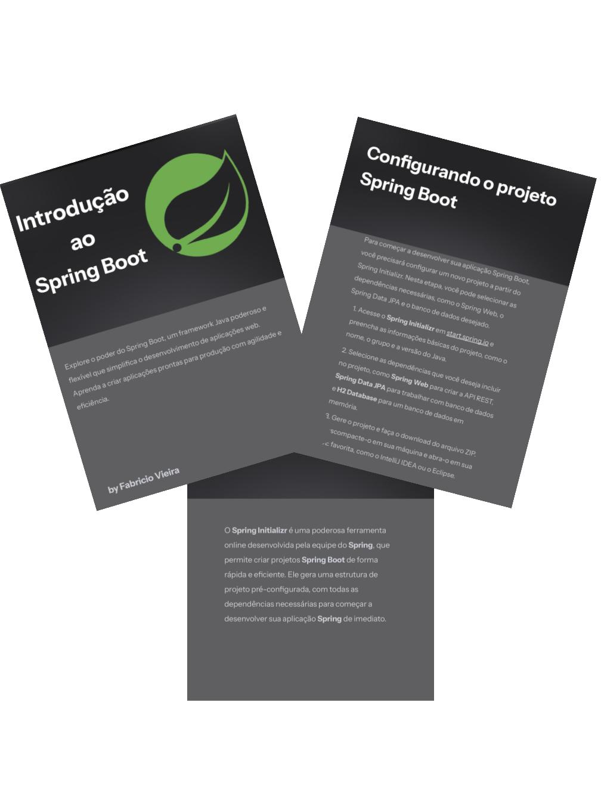

-------

# Projeto EBOOK Gerado por I.A.s

 > ℹ️ **NOTE:** Este é o repositório desenvolvido durante o curso no qual fui aluno na plataforma da [DIO](https://dio.me)

Projeto com o objetivo de gerar um ebook digital com as facilidades das ferramentas de IA.

<a href="https://github.com/vieira-fabricio/ebook-created-with-IA/blob/main/ebook/Introducao-ao-Spring-Boot.pdf" title="Veja o PDF agora"> 📕Clique aqui para ler</a>

## 💻 Tecnologias utilizadas no projeto

- [Gamma.app](https://gamma.app/) 
- [Leonardo ia](https://leonardo.ai/)
- [PowerPoint](https://www.microsoft.com/en/microsoft-365/powerpoint)

## ✨ Features

- Conteúdo gerado via Gamma.app
- Imagens geradas via Leonardo IA

## 📚 Materiais

- Imagens utilizadas em `assets`
- ebook gerado durante as aulas em `ebook`

## 🛠️ Instruções de execução

Utilize prompts nas ferramentas sugeridas para gerar o material base e utilize uma ferramenta de edição de documentos como power point, libreoffice , etc.

## 👨‍💻 Expert

&nbsp&nbsp&nbspFabricio Vieira 
    &nbsp&nbsp&nbsp
    <a href="https://github.com/vieira-fabricio">
    GitHub</a>&nbsp;|&nbsp;
    <a href="https://www.linkedin.com/in/vieira-fabricio/">LinkedIn</a>
&nbsp;|&nbsp;
    <a href="https://www.instagram.com/diar.iodev/">
    Instagram</a>
&nbsp;|&nbsp;

  

---

por [Fabricio Vieira](https://github.com/vieira-fabricio)
